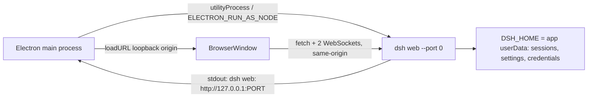

# DeepSeek Harness Desktop (Electron) — Plan

This directory is **fork-owned**. The upstream repository does not have `apps/desktop`, and the
goal is that it never needs to: the desktop app is maintained only here, while the harness itself
keeps syncing from upstream with near-zero conflict surface.

## 1. How the harness works today (facts this plan builds on)

- The browser UI is a static React SPA (`@deepseek-ai/dsh-web-frontend`, `apps/web`) built by Vite.
- `dsh web` (= `dsh --profile web`) boots the full harness and serves that dist over a loopback
  `node:http` server (default `127.0.0.1:3080`). It injects `window.__DSH_BOOT__` into `index.html`.
- The renderer is transport-agnostic: it talks to its own origin via JSON-RPC `POST /api/<method>`
  plus two WebSockets (`/api/events.mux`, `/api/events.host`). Base URL comes from `location.origin`.
- `--port 0` requests an OS-assigned port; readiness is announced on stdout as
  `dsh web: http://127.0.0.1:<port>` after Loader settlement.
- All user data lives under `$DSH_HOME` (default `~/.dsh`): sessions, `settings.yaml`,
  `.credentials.yaml` (written by the web Models page), profiles.
- Profiles auto-initialize offline: `healProfilesModuleFallback` symlinks the CLI installation's
  entire dependency closure into `$DSH_HOME/profiles/node_modules`, so a flat, symlink-free
  `node_modules` closure of `@deepseek-ai/dsh` is everything the server needs to boot.
- `scripts/build-exe-for-python-sdk.ts` already materializes exactly such a closure via
  `pnpm ... deploy --legacy --prod --config.node-linker=hoisted ...` plus link-materialization.
- Python is not a runtime dependency. Native modules in the closure: `node-pty` and
  `node-addon-require-builtin` (both need an Electron-ABI rebuild); Landlock ships as prebuilt
  static binaries; SQLite is `node:sqlite`; ripgrep ships as platform binaries.

## 2. Architecture decision

**Phase-1 architecture: a thin Electron shell over the real server.**



- The Electron main process spawns the packaged `dsh` server (`web` profile) on `127.0.0.1` with
  `--port 0`, parses the readiness URL line, then loads a `BrowserWindow` pointed at that origin.
- The renderer runs the **unmodified** web app: no `file://`, no IPC carrier, no `__DSH_BOOT__`
  reimplementation, no changes to `packages/`. This is what makes upstream sync painless.
- Electron's own binary provides Node for end users (`ELECTRON_RUN_AS_NODE=1 process.execPath
  <staging>/node_modules/@deepseek-ai/dsh/lib/bin.js web --port 0`) — no system Node required.
- The loopback trust fence already accepts `Host: 127.0.0.1:<port>`; privileged RPCs are
  loopback-pinned. Security posture equals the browser product.

The repo's docs sketch a future IPC carrier (`doFetch` swap on `AbstractApiClient`); that is a
later optimization only if we want `file://` loading. It is not needed for v1 and would require
harness changes that conflict with the sync goal.

## 3. Repository layout and upstream-sync model

```
apps/desktop/                 # fork-owned, new, never touched by upstream
  PLAN.md                     # this file
  README.md                   # testing and release workflows
  package.json                # dsh-desktop: private, unscoped (bypasses app-package gates)
  tsconfig.json               # standalone typecheck project (not in repo aggregates)
  electron-builder.yml        # phase 2: packaging config
  .gitignore                  # local outputs (build/, out/, dist/, node_modules/)
  src/
    main/                     # main process: spawn, readiness, windows, lifecycle, menu, tray
    preload/                  # minimal bridge (contextBridge), contextIsolation on
  resources/                  # icons, entitlements (macOS)
  server-deploy/package.json  # deploy root: dependency manifest for the harness closure
  scripts/
    build-app.mjs             # esbuild bundle of main (ESM) + preload (CJS)
    stage-server.mjs          # pnpm deploy + materialize links + closure gate
    smoke-boot.mjs            # boot proof: readiness line, served app, clean exit
    gen-server-deploy-manifest.mjs  # regenerate deploy manifest from the CLI closure
  tests/                      # smoke tests: server boot, readiness parse, window load
```

Shared-file footprint in the fork (everything else upstream owns and we never edit):

- `pnpm-workspace.yaml`: one added member line, `apps/desktop/server-deploy` (verified: `pnpm deploy`
  cannot select a non-member project, so the deploy root must be a workspace member).
- `knip.json`: `apps/desktop/server-deploy` added to `ignoreWorkspaces` (the established pattern for
  non-conforming workspaces like `python/sdk-runtime`).
- These two one-line edits are the only upstream-owned files we touch; a merge conflict there is a
  one-line fix each.
- `apps/desktop/package.json` is `"private": true` and uses an unscoped or personal-scoped name
  (e.g. `dsh-desktop`) so `check-workspace-constraints` and the app-package-files policy skip it.
- New CI workflow `.github/workflows/desktop-release.yml` is additive; name it so it cannot
  collide with upstream workflow names.

Branch model:

- `upstream` remote = `github.com/deepseek-ai/deepseek-harness`; add it now (missing today).
- The existing fork branch `apps` is the fork-only desktop maintenance branch:
  `apps = upstream/master + apps/desktop/** + the knip one-liner`.
- Sync: `git fetch upstream && git checkout apps && git rebase upstream/master`; conflicts are
  structurally limited to `knip.json` (and never to `apps/desktop`).
- Contributions to the harness itself branch off `upstream/master`, never off `apps`, so upstream
  PR CI never sees the desktop directory.

## 4. Packaging pipeline

1. `pnpm install` after each upstream sync; `pnpm run build` (builds host/client libs + web dist).
2. `apps/desktop/scripts/stage-server.mjs`:
   - `pnpm --filter dsh-desktop-server-deploy deploy --legacy --prod --config.node-linker=hoisted --config.auto-install-peers=false --config.link-workspace-packages=true <staging>` (same flags as the proven exe pipeline). `apps/desktop/server-deploy` is a workspace member (one added line in `pnpm-workspace.yaml`), and its dependency list is **generated** by `apps/desktop/scripts/gen-server-deploy-manifest.mjs` from the CLI's workspace closure; `scripts/verify-runtime-closure.ts` gates the manifest, so an upstream sync that adds a workspace peer fails the stage with a regenerate hint.
   - Materializes remaining symlinks and hoists (ported from `scripts/build-exe-for-python-sdk.ts`).
   - `npx @electron/rebuild -m <staging>` against the Electron ABI (verified: only `node-pty` needs it; `sharp`/`koffi` are N-API and load as-is).
   - Verified (2026-08-16, Electron 43.4.0, embedded Node 24.18.1): the staged closure boots offline and serves the assembled app under `ELECTRON_RUN_AS_NODE=1` — see §4b.
3. `electron-builder` packages `apps/desktop` with `extraResources: build/server` (server closure stays out of the asar; native modules unpacked). Targets: `dmg`+`zip` (macOS, both arches), `nsis` (Windows), `AppImage`+`deb` (Linux).
4. Signing/notarization: ship unsigned for development; add Apple Developer ID + notarization and Windows code signing as a phase-3 item (credentials in fork repo secrets).

Electron version constraint: pick the newest stable Electron whose embedded Node satisfies `^22.19.0 || >=24.0.0`. Verified at selection time: Electron 43.4.0 embeds Node 24.18.1 (satisfies the engines). Pin it in `apps/desktop/package.json` and bump only deliberately.

## 4b. Phase-0 verification record (done 2026-08-16)

Verified against a real Electron binary, not just system Node:

- `stage-server.mjs` → `build/server` closure passes the entry checks and the runtime-closure gate (191 workspace packages, closed graph).
- `smoke-boot.mjs` boots `dsh web --port 0`, parses the `dsh web: http://127.0.0.1:<port>` readiness line, fetches `/`, asserts the injected `window.__DSH_BOOT__` manifest and the app root, then SIGTERMs the server to a clean code-0 exit. PASS under both system Node 26 and Electron 43.4.0 (`ELECTRON_RUN_AS_NODE=1`, embedded Node 24.18.1).
- **The spawn must pass `--expose-internals`**: the web profile always mounts the client-HMR chain, and the cordis loader's internals fallback (`node-addon-require-builtin`, a Node-API addon) probes Electron's runtime as unsupported, so only the `--expose-internals` branch works under Electron-as-node. Verified: `process.execArgv` carries the flag and the server boots with it.
- ABI facts: `node-pty` must be rebuilt for Electron (`@electron/rebuild` found and rebuilt it); `sharp` and `koffi` (N-API) load without rebuild under the ad-hoc Electron binary. An Apple-signed Electron (e.g. VS Code's) enforces library validation and rejects the unsigned native modules — that is the hardened-runtime case our notarized builds must sign for (phase 3).
- Environment note: in this VS Code agent sandbox, `pnpm deploy` needs host filesystem access (the sandbox denies writing package files named `.gitmodules`/`.idea`) and the npm registry for its standalone `@pnpm/exe`; the plain terminal of a developer or CI has neither restriction.

## 5. Runtime behavior (main process)

- `app.requestSingleInstanceLock()`; second instance focuses the first window.
- Set `DSH_HOME` to `app.getPath('userData')` (isolated from the CLI's `~/.dsh`); a later setting
  can opt into sharing `~/.dsh`.
- Spawn the server; buffer stdout/stderr; readiness = regex on the `dsh web:` URL line with a
  timeout; on failure show a dialog with the child's diagnostics and a "Retry / Open logs" action.
- `BrowserWindow`: `contextIsolation: true`, `nodeIntegration: false`, `sandbox: true`,
  `webSecurity` on; `setWindowOpenHandler` routes http(s) to `shell.openExternal`.
- Child lifecycle: on quit send SIGTERM and wait the bounded shutdown window
  (`dsh` has `PROCESS_SHUTDOWN_TIMEOUT_MS`); kill after timeout. Handle unexpected child exit
  (error window, restart button). macOS: `activate` / `window-all-closed` conventions.
- Smoke tests (`apps/desktop/tests`): stage → spawn → parse readiness → fetch `/` and one RPC →
  quit → child exits cleanly. Run in the fork's desktop CI on all three OSes.

## 6. Phased roadmap

- **Phase 0 — sync + proof (done 2026-08-16)** `upstream` remote added and `upstream/master` fetched; `apps/desktop/server-deploy` + generated manifest, `stage-server.mjs`, `smoke-boot.mjs` land; the deployed web profile boots offline and serves the assembled app under system Node and Electron 43.4.0 (see §4b). `pnpm-workspace.yaml` gains the deploy-root member line and `knip.json` the ignore entry.
- **Phase 1 — dev-mode desktop app (done 2026-08-17)** `dsh-desktop` package: main process spawns the staged server (`ELECTRON_RUN_AS_NODE=1`, `--expose-internals`, `--port 0`), parses readiness, opens a locked-down BrowserWindow on the ready URL, single-instance lock, Quit/Retry failure dialog, graceful SIGTERM→SIGKILL shutdown, `DSH_HOME` = userData, stderr teed to `userData/server.log`; sandboxed preload bridge; esbuild build + typecheck; `pnpm --filter dsh-desktop start` runs it.
- **Phase 1 — dev-mode desktop app** Electron shell spawning the workspace-built server
  (`pnpm dsh web --port 0` equivalent) from a checkout; window, menu, tray, lifecycle, DSH_HOME
  isolation; manual run on macOS/Windows/Linux. No packaging yet.
- **Phase 2 — packaged installers** `electron-builder` for the three OSes; native-ABI rebuild;
  unsigned installers downloadable from fork Releases; smoke-test each artifact in CI.
- **Phase 3 — distribution polish** Icons, code signing + notarization (macOS) and Windows
  signing, auto-update via `electron-updater` against fork Releases, telemetry opt-out toggle
  surfaced in Settings, docs on `apps/desktop/README.md`.

## 7. Risks and decisions

- **Electron-embedded Node < 22.19**: blocks boot. Mitigated by the version-selection gate in §4.
- **`node-pty` ABI**: rebuild against Electron headers at stage time; CI asserts the rebuild ran
  (fail if the staging dir contains a Node-ABI builElectron 43.4.0 embeds Node 24.18.1 — verified.
- **`--expose-internals` is mandatory in the server spawn**: without it, the cordis HMR chain fails
  under Electron (the Node-API fallback addon does not support Electron's runtime). The desktop
  main process must pass the flag; `smoke-boot.mjs` already asserts the boot with it.
- **`node-pty` ABI**: rebuild against Electron headers at stage time; CI asserts the rebuild ran
  (fail if the staging dir contains a Node-ABI build).
- **Hardened-runtime signing**: an Apple-signed Electron enforces library validation on native
  modules (observed with VS Code's Electron); our notarized macOS builds must sign the staged
  native modules with the same identity (phase 3). Unsigned dev builds are unaffectedhase 1; if a platform lacks an acceptable
  sandbox, surface it in the app rather than silently changing policy.
- **Loopback API is reachable by local processes**: identical to browser mode today. A shared-secret
  token would need a webserver/connection change in the harness — propose it upstream later if
  desired; not a v1 blocker.
- **Upstream file moves/renames** (e.g. `apps/web` → elsewhere) are handled by the usual rebase;
  the desktop app depends only on package names and the stable `dsh web` contract.
